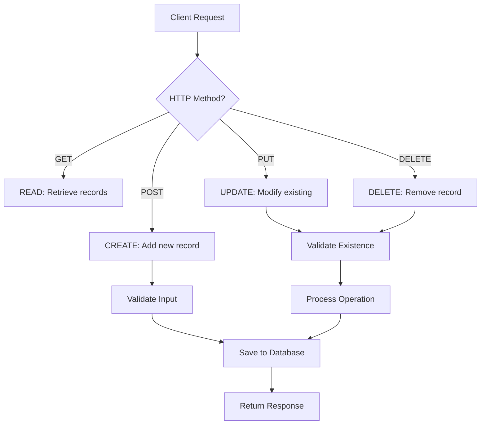

# 🚀 PUT & DELETE in FastAPI | Complete CRUD Operations

## 📑 Table of Contents

1. [📖 Introduction/Overview](#-introductionoverview)
2. [🔄 Current Progress Review](#-current-progress-review)
3. [🛠️ UPDATE Endpoint Implementation](#️-update-endpoint-implementation)
4. [🗑️ DELETE Endpoint Implementation](#️-delete-endpoint-implementation)
5. [⚡ Quick Reference](#-quick-reference)
6. [📊 Summary Table](#-summary-table)
7. [🎯 Key Takeaways](#-key-takeaways)
8. [💡 Pro Tips](#-pro-tips)

---

## 📖 Introduction/Overview

This lecture completes the **Patient Management System API** by implementing the remaining CRUD operations - **UPDATE** and **DELETE**. We'll learn how to handle partial updates, recompute calculated fields, and safely delete records using proper HTTP methods and error handling.

> **Why This Matters**: CRUD operations form the backbone of any data management system. Understanding how to properly implement UPDATE and DELETE operations is crucial for building production-ready APIs.

---

## 🔄 Current Progress Review

### 🏗️ What We've Built So Far

Our Patient Management System currently has **4 endpoints**:

| Endpoint | Method | Purpose | Status |
|----------|--------|---------|--------|
| `/view` | GET | View all patients | ✅ Complete |
| `/patient/{id}` | GET | View specific patient | ✅ Complete |
| `/sort` | GET | View patients sorted by weight/height/BMI | ✅ Complete |
| `/create` | POST | Add new patient | ✅ Complete |

### 🎯 Today's Goal

Complete the CRUD operations by adding:
- **UPDATE** endpoint (using PUT method)
- **DELETE** endpoint (using DELETE method)

---

## 🛠️ UPDATE Endpoint Implementation

### 🤔 Understanding the Challenge

The UPDATE operation is tricky because:
- Client might want to update **all fields** or just **some fields**
- We need to handle **partial updates** gracefully
- **Computed fields** (BMI, verdict) must be recalculated when related fields change

### 📋 UPDATE Endpoint Requirements

| Component | Details |
|-----------|---------|
| **HTTP Method** | PUT |
| **Endpoint Name** | `/edit/{patient_id}` |
| **Inputs** | Patient ID (path parameter) + Request body (JSON) |
| **Process** | Validate → Update → Recalculate → Save |

### 🔧 Step-by-Step Implementation

#### Step 1: Create New Pydantic Model for Updates

```python
from typing import Optional

class PatientUpdate(BaseModel):
    name: Optional[str] = Field(default=None)
    city: Optional[str] = Field(default=None)
    age: Optional[int] = Field(default=None)
    gender: Optional[str] = Field(default=None)
    height: Optional[float] = Field(default=None)
    weight: Optional[float] = Field(default=None)
```

> **Why New Model?**: The original `Patient` model has all fields as required. For updates, we need all fields to be optional since clients might only want to update specific fields.

#### Step 2: Create the UPDATE Endpoint

```python
@app.put("/edit/{patient_id}")
def update_patient(patient_id: str, patient_update: PatientUpdate):
    # Load existing data
    data = load_data()
    
    # Check if patient exists
    if patient_id not in data:
        raise HTTPException(status_code=404, detail="Patient not found")
    
    # Get existing patient info
    existing_patient_info = data[patient_id]
    
    # Convert update object to dictionary (exclude unset fields)
    updated_patient_info = patient_update.model_dump(exclude_unset=True)
    
    # Update existing info with new values
    for key, value in updated_patient_info.items():
        existing_patient_info[key] = value
    
    # Add patient_id for Pydantic object creation
    existing_patient_info['patient_id'] = patient_id
    
    # Create Pydantic object to recalculate computed fields
    patient_pydantic_object = Patient(**existing_patient_info)
    
    # Convert back to dictionary (exclude id)
    existing_patient_info = patient_pydantic_object.model_dump(exclude={'patient_id'})
    
    # Update data and save
    data[patient_id] = existing_patient_info
    save_data(data)
    
    return JSONResponse(status_code=200, content={"message": "Patient updated"})
```

### 🔍 Key Concepts Explained

#### `exclude_unset=True`
```python
updated_patient_info = patient_update.model_dump(exclude_unset=True)
```
> **Purpose**: Only includes fields that were actually provided by the client, ignoring fields with default `None` values.

#### Computed Fields Recalculation
```python
# This step triggers recalculation of BMI and verdict
patient_pydantic_object = Patient(**existing_patient_info)
```
> **Why Needed**: When weight or height changes, BMI and verdict must be automatically recalculated.

### 🧪 Testing the UPDATE Endpoint

#### Test Case 1: Update Multiple Fields
```json
PUT /edit/P004
{
    "city": "Mumbai",
    "weight": 90
}
```

**Expected Result**:
- City: Bengaluru → Mumbai
- Weight: 95 → 90
- BMI: 29.32 → 27.78 (recalculated)
- Verdict: Overweight → Normal (recalculated)

#### Test Case 2: Update Single Field
```json
PUT /edit/P001
{
    "name": "Ananya Verma"
}
```

#### Test Case 3: Invalid Patient ID
```json
PUT /edit/P010
{
    "name": "Test"
}
```
**Expected**: 404 Patient not found

---

## 🗑️ DELETE Endpoint Implementation

### 📋 DELETE Endpoint Requirements

| Component | Details |
|-----------|---------|
| **HTTP Method** | DELETE |
| **Endpoint Name** | `/delete/{patient_id}` |
| **Input** | Patient ID (path parameter only) |
| **Process** | Validate → Delete → Save |

### 🔧 Implementation

```python
@app.delete("/delete/{patient_id}")
def delete_patient(patient_id: str):
    # Load existing data
    data = load_data()
    
    # Check if patient exists
    if patient_id not in data:
        raise HTTPException(status_code=404, detail="Patient not found")
    
    # Delete the patient record
    del data[patient_id]
    
    # Save updated data
    save_data(data)
    
    return JSONResponse(status_code=200, content={"message": "Patient deleted"})
```

### 🧪 Testing the DELETE Endpoint

#### Test Case 1: Valid Patient ID
```
DELETE /delete/P006
```
**Expected**: 200 Patient deleted

#### Test Case 2: Invalid Patient ID
```
DELETE /delete/P010
```
**Expected**: 404 Patient not found

---

## ⚡ Quick Reference

### HTTP Methods Summary
```python
# CREATE
@app.post("/create")

# READ
@app.get("/view")
@app.get("/patient/{id}")

# UPDATE
@app.put("/edit/{patient_id}")

# DELETE
@app.delete("/delete/{patient_id}")
```

### Pydantic Model Operations
```python
# Convert to dict (exclude unset fields)
model.model_dump(exclude_unset=True)

# Convert to dict (exclude specific fields)
model.model_dump(exclude={'field_name'})

# Create object from dict
ModelClass(**dictionary)
```

### Error Handling Pattern
```python
if condition_not_met:
    raise HTTPException(status_code=404, detail="Error message")
```

---

## 📊 Summary Table

| Operation | Method | Endpoint | Input | Key Challenge | Solution |
|-----------|--------|----------|-------|---------------|----------|
| **CREATE** | POST | `/create` | Full patient data | Data validation | Pydantic models |
| **READ** | GET | `/view`, `/patient/{id}` | Optional filters | Data retrieval | JSON file operations |
| **UPDATE** | PUT | `/edit/{patient_id}` | Partial patient data | Computed fields | Pydantic object recreation |
| **DELETE** | DELETE | `/delete/{patient_id}` | Patient ID only | Data integrity | Existence validation |

---

## 🎯 Key Takeaways

### 🔑 Essential Concepts

1. **Partial Updates**: Use `Optional` fields and `exclude_unset=True` for flexible updates
2. **Computed Fields**: Recreate Pydantic objects to trigger recalculation
3. **Error Handling**: Always validate existence before operations
4. **HTTP Methods**: Use appropriate methods (PUT for update, DELETE for delete)
5. **Data Consistency**: Ensure related fields update together

### 🚨 Common Pitfalls to Avoid

| Mistake | Problem | Solution |
|---------|---------|----------|
| Using required fields in update model | Client must send all fields | Use `Optional` fields |
| Forgetting computed fields | Stale calculated values | Recreate Pydantic object |
| No existence validation | Operations on non-existent data | Check before operations |
| Wrong HTTP methods | Poor API design | Follow REST conventions |

---

## 💡 Pro Tips

### 🎨 Code Organization Tips
- **Separate Models**: Create different Pydantic models for different operations
- **Consistent Error Handling**: Use same pattern for all endpoints
- **Validation First**: Always validate inputs before processing

### 🔧 Performance Considerations
- **Minimal Processing**: Only update fields that actually changed
- **Efficient Validation**: Use Pydantic's built-in validation features
- **Error Early**: Validate existence before heavy operations

### 🛡️ Security Best Practices
- **Input Validation**: Never trust client input
- **Existence Checks**: Prevent operations on non-existent resources
- **Proper Status Codes**: Use correct HTTP status codes for different scenarios

### 🚀 Next Steps
- **Database Integration**: Replace JSON file with actual database
- **Authentication**: Add user authentication and authorization
- **Logging**: Implement proper logging for operations
- **Testing**: Write comprehensive unit tests

---

## 🎓 Real-World Applications

### 🏥 Healthcare Systems
- **Patient Records**: Update medical information, delete discharged patients
- **Appointment Management**: Modify appointment details, cancel appointments

### 🛒 E-commerce Platforms
- **Product Management**: Update prices/inventory, remove discontinued items
- **User Profiles**: Modify user information, deactivate accounts

### 📚 Educational Systems
- **Student Records**: Update grades/contact info, remove graduated students
- **Course Management**: Modify course details, delete obsolete courses

---

## 🔄 Complete CRUD Workflow



This completes our Patient Management System with full CRUD functionality! The next step is integrating machine learning models for real-world applications. 🚀